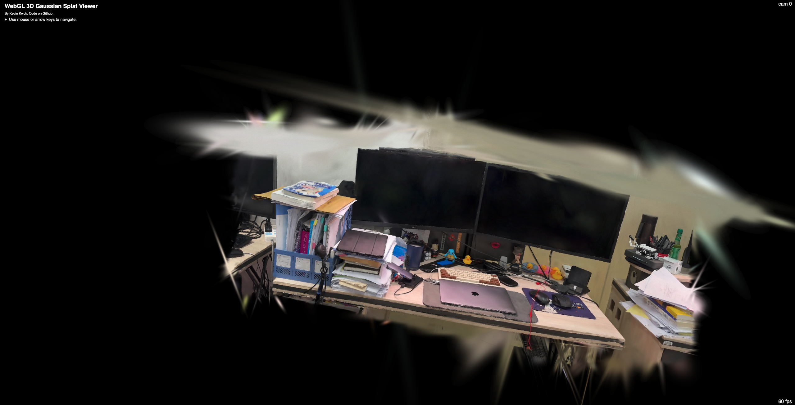
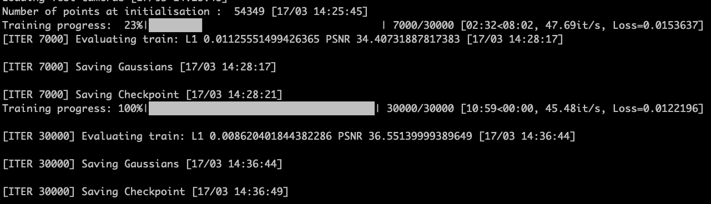

<!--
 * @Author: SimonCK666 SimonYang223@163.com
 * @Date: 2024-03-17 14:52:00
 * @LastEditors: SimonCK666 SimonYang223@163.com
 * @LastEditTime: 2024-03-17 15:09:31
 * @FilePath: /splat/README.md
 * @Description: 这是默认设置,请设置`customMade`, 打开koroFileHeader查看配置 进行设置: https://github.com/OBKoro1/koro1FileHeader/wiki/%E9%85%8D%E7%BD%AE
-->
# WebView for 3D Gaussian Platting Reconstruction Results

> Using [original repo](https://github.com/antimatter15/splat) for @antimatter15

## Convert .ply Result to .splat Viewer File

- Using `convert.py` file to convert the [Officially 3DGS](https://github.com/graphdeco-inria/gaussian-splatting) point cloud results.

- Using following commend:

```python
python convert.py ply/3dgs.ply --output 3dgs30000.splat
```

## Using HuggingFace to store the .splat file

- Upload converted `.splat` file onto [HuggingFace](https://huggingface.co/)

## Edit `main.js` file for target scene

- Edit `Line760` in `main.js` for [HuggingFace Repo](https://huggingface.co/Simonooooo/gaussian-splat/tree/main)

> Tips: Change the link for HuggingFace Repo like `https://huggingface.co/username/repo_name/tree/main` to `https://huggingface.co/username/repo_name/resolve/main`

- Edit `Line755` in `main.js` for **target scene .splat file**

> Tips: Like: `params.get("url") || "3dgs30000.splat"`

## Using Link for Viewer

- Using HTML `index.html` to view the target reconstruction scene

```python
file:///Users/simon.yang/Desktop/splat/index.html
```

## Example




